# Mini_Projet-Linux-Shell-Scripting

## The following implementation showcases my comprehension of basic shell scripting concepts and techniques.

- Shell scripting allows us to authomating processes.

## The following are snapshots of various commands and scripts that I wrote to automate some simple processes using `bash` one of various types of shell scripting languages which includes `sh`, `zsh`, and `PowerShell`.

# TASK 1:
1. Create a folder on an ubuntu server and name it shell-scripting
2. Using the `vim` editor, create a file called `my_first_shell_script.sh`
3. Put the shell script code above into the new file
4. Save the file
5. Use cd command to change into the `shell-scripting` directory
6. Use `ls -latr' command to confirm that the file is indeed created.

## Solution:
 - To create folder named `shell-scripting` on my ubuntu server.

 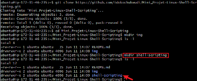

 - To create shell file

 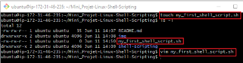

 - `vim` text editor with shell script code

 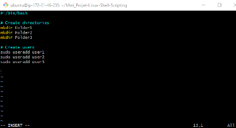

 - `ls -latr` command to confirm file that is created.

 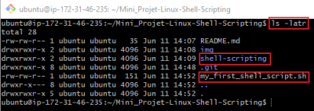

 The above script will not run because there is no executable permission attached to it. thus if I try to execute the script with the command `./ my_first_shell_script.sh` it will return `Permission denied` message.

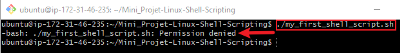

# TASK 2
1. Add the execute permission for the `owner` to be able to execute the shell script
2. Run the shell script
3. Evaluate and ensure that 3 folders are created
4. Evaluate and ensure that 3 users are created on the linux server

## Solusion:

- To add permission

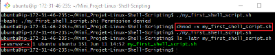

- To run the shell script

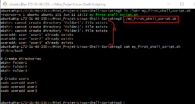

The above output shows that the script has successfuly ran and three folder and three users are in existence.

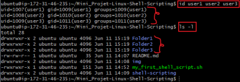

## Shebang (#!/bin/bash)
This is a special notation used in Unix-like operating systems like Linux, to specify the interpreter that should be used to execute the script.

## Variable Declaration and Initialization
Variables are used to store data of various types such as numbers, strings, and arrays.
Variables are assigned values using `=` operator, and access their values using the variable name preceded by a `$` sign.

Example:
Creating `name` variable and assigning `Ziva` to it.

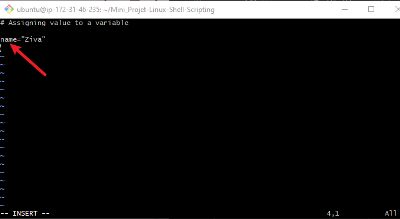

### Retrieving value from a variable

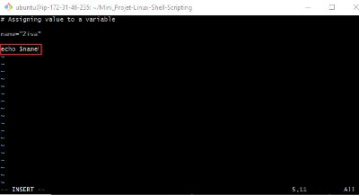

### Running the script

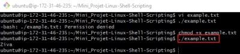

`echo` is a command used to print a text, variables or values. In the above example, echo is used to print a variable `name` which stores a value `ziva`

### The above implementation demonstrates my foundational skills in shell scripting.

